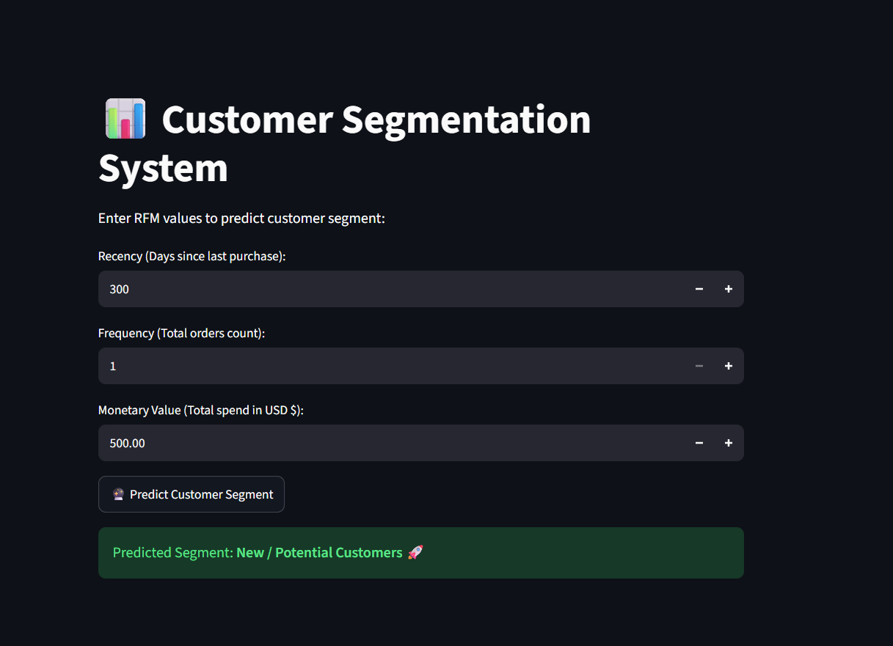

# 📊 Customer Segmentation using RFM Analysis

A Machine Learning project for segmenting customers based on their purchasing behavior using **RFM Analysis** and **K-Means Clustering**.

## 🎯 Project Overview

Customer segmentation helps businesses understand different groups of customers based on their purchasing behavior.

In this project, customers are analyzed using three RFM features:

* **Recency:** Number of days since the customer's last purchase.
* **Frequency:** Number of orders made by the customer.
* **Monetary:** Total amount spent by the customer.

The RFM features are scaled and then used with **K-Means Clustering** to group customers into meaningful segments.

## 🤖 Customer Segments

The model identifies three customer segments:

* 🏆 **Champions**
* ⚠️ **At-Risk Customers**
* 🚀 **New / Potential Customers**

## 🖥️ Interactive GUI

In addition to the original team project, I developed a **Streamlit-based GUI** independently.

The application allows users to enter:

* Recency
* Frequency
* Monetary Value

and receive the predicted customer segment from the trained K-Means model.

## 🖥️ GUI Preview



### GUI Workflow

```text
User Input
    ↓
RFM Values
    ↓
Feature Scaling
    ↓
K-Means Model
    ↓
Predicted Customer Segment
```

## 👩🏻‍💻 My Contribution

This was originally a team project where I worked as the **Driver**.

My responsibilities included:

* Reviewing and modifying the project code.
* Making adjustments to improve compatibility across different environments and devices.
* Helping define and communicate the rules and workflow that the team followed.
* Independently designing and developing the Streamlit GUI as an additional part of the project.

## 🛠️ Technologies

* Python
* Pandas
* NumPy
* Scikit-learn
* K-Means Clustering
* RFM Analysis
* Streamlit
* Joblib
* Jupyter Notebook
* Git & GitHub

## 📁 Project Structure

```text
customer-segmentation/
│
├── README.md
├── a1-g07-01-ml-project.ipynb
├── app.py
├── kmeans_model.pkl
└── scaler.pkl
```

## ▶️ How to Run the GUI

Clone the repository:

```bash
git clone https://github.com/ghaboursara-hub/customer-segmentation.git
```

Install the required dependencies:

```bash
pip install -r requirements.txt
```

Run the Streamlit application:

```bash
streamlit run app.py
```

## 📌 Notes

The trained K-Means model and scaler are included in the repository so that the Streamlit application can load the trained components and make predictions.

---

### Project Type

**Machine Learning | Customer Segmentation | RFM Analysis | Streamlit Application**
